<picture>
  <source media="(prefers-color-scheme: dark)" srcset="assets/banner-dark.svg">
  
</picture>

<!-- On a phone the donut sits above the name; on anything wider it floats
     to the right of the intro. The blank source hides whichever copy is
     not in use. -->

  <picture>
    <source media="(min-width: 601px)" srcset="assets/blank.svg">
    <source media="(prefers-color-scheme: dark)" srcset="assets/donut-dark.svg">
    
  </picture>

<picture>
  <source media="(max-width: 600px)" srcset="assets/blank.svg">
  <source media="(prefers-color-scheme: dark)" srcset="assets/donut-dark.svg">
  
</picture>

# hi, prashant here 👋

**AI Engineer / Developer** &middot; India

### Code, Create, and Conquer.

<a href="https://prashantyadav.vercel.app"><picture><source media="(prefers-color-scheme: dark)" srcset="https://img.shields.io/badge/Portfolio-prashantyadav.vercel.app-4798f5?style=flat-square&logo=vercel&logoColor=white"></picture></a> <a href="https://prashantyadav.vercel.app/resume.pdf"><picture><source media="(prefers-color-scheme: dark)" srcset="https://img.shields.io/badge/Resume-PDF-4798f5?style=flat-square&logo=readdotcv&logoColor=white"></picture></a> <a href="https://www.linkedin.com/in/prashantyadav097"><picture><source media="(prefers-color-scheme: dark)" srcset="https://img.shields.io/badge/LinkedIn-prashantyadav097-4798f5?style=flat-square&logo=linkedin&logoColor=white"></picture></a> <a href="https://x.com/0prashantyadav0"><picture><source media="(prefers-color-scheme: dark)" srcset="https://img.shields.io/badge/X-@0prashantyadav0-4798f5?style=flat-square&logo=x&logoColor=white"></picture></a> <a href="mailto:devprashantkyadav@gmail.com"><picture><source media="(prefers-color-scheme: dark)" srcset="https://img.shields.io/badge/Email-devprashantkyadav@gmail.com-4798f5?style=flat-square&logo=gmail&logoColor=white"></picture></a>

I am an AI-native developer who builds agentic systems and microservice architectures, an open-source contributor, and a creative engineer who is always up for learning something new.

 

<picture>
  <source media="(prefers-color-scheme: dark)" srcset="assets/rule-dark.svg">
  
</picture>

## Tech stack

## GitHub

<a href="https://github.com/0PrashantYadav0">
  <picture>
    <source media="(prefers-color-scheme: dark)" srcset="https://streak-stats.demolab.com?user=0PrashantYadav0&hide_border=true&background=00000000&ring=4798f5&fire=4798f5&currStreakNum=e6edf3&sideNums=e6edf3&currStreakLabel=4798f5&sideLabels=929caa&dates=929caa&stroke=3d444d&date_format=j%20M%5B%20Y%5D">
    
  </picture>
</a>

<picture>
  <source media="(prefers-color-scheme: dark)" srcset="https://raw.githubusercontent.com/0PrashantYadav0/0PrashantYadav0/output/snake.svg">
  
</picture>

<picture>
  <source media="(prefers-color-scheme: dark)" srcset="assets/rule-dark.svg">
  
</picture>

Everything else, including all my projects and Dev Senpai, the chatbot that answers questions about my work, lives at [prashantyadav.vercel.app](https://prashantyadav.vercel.app).

> *Talk is cheap. Show me the code* -
> Linus Torvalds
